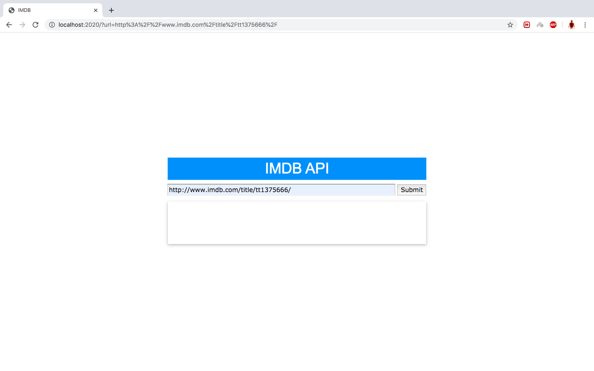
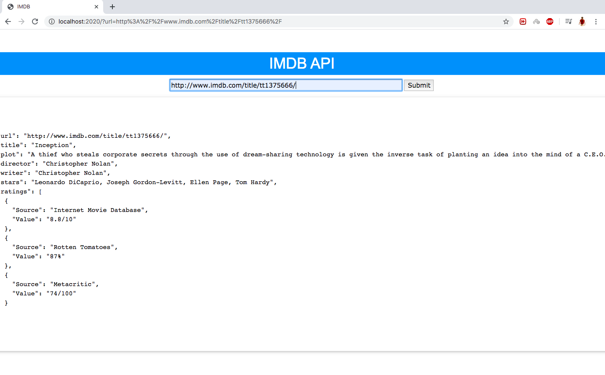
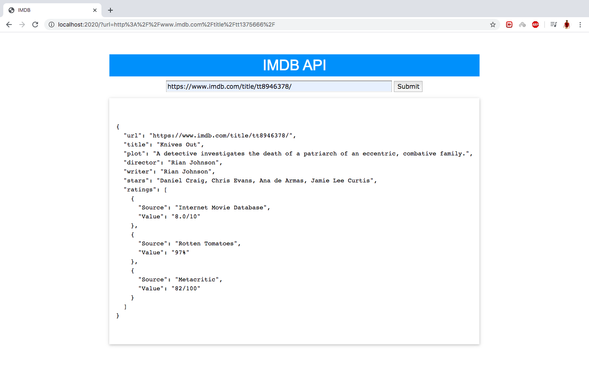
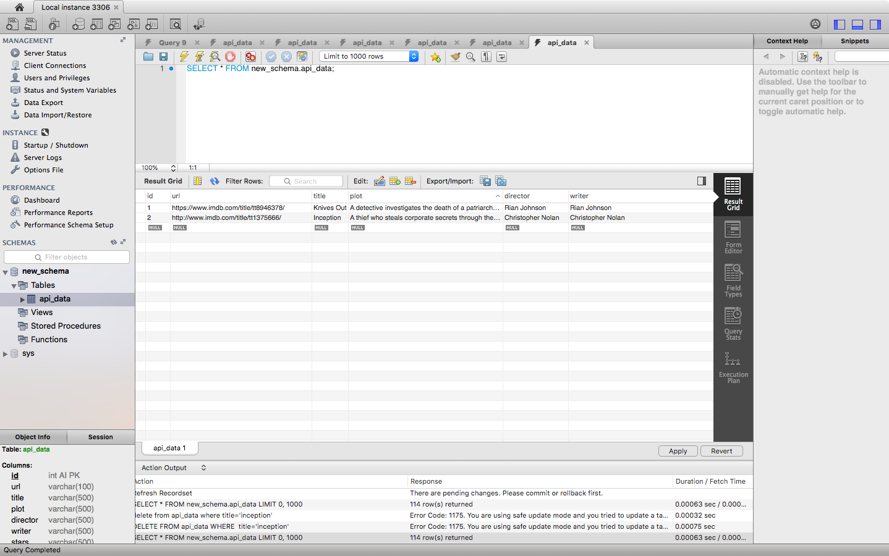

# IMDB_API
1.I have created an API (get request) in node JS express framework which should take the IMDB
movie url(http://www.imdb.com/title/tt1375666/) as query parameter
and fetch the given information
1.Movie Title
2. Plot Summary
3. Director
4. Writer
5. Stars
6. IMDB community rating

2.I just Format the extracted data in JSON and send it back as response and created a form which has text field
and submit button in html and the text field  take the IMDB movie url as an input and on clicking submit button, 
the API has been requested and Render the data from JSON response and show it on the same page.

3.Finally I am storing the requested data in Mysql

output images:

sql:

I had used express js framework,Request method for api get request,JSON for response,Mysql for database.
